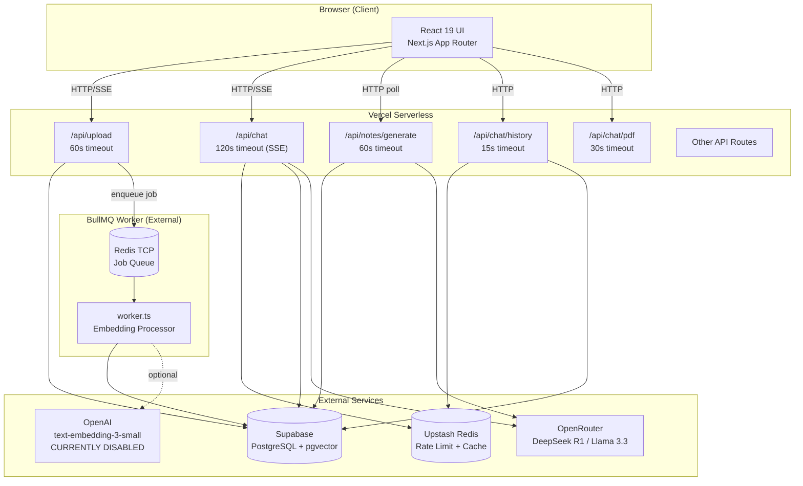
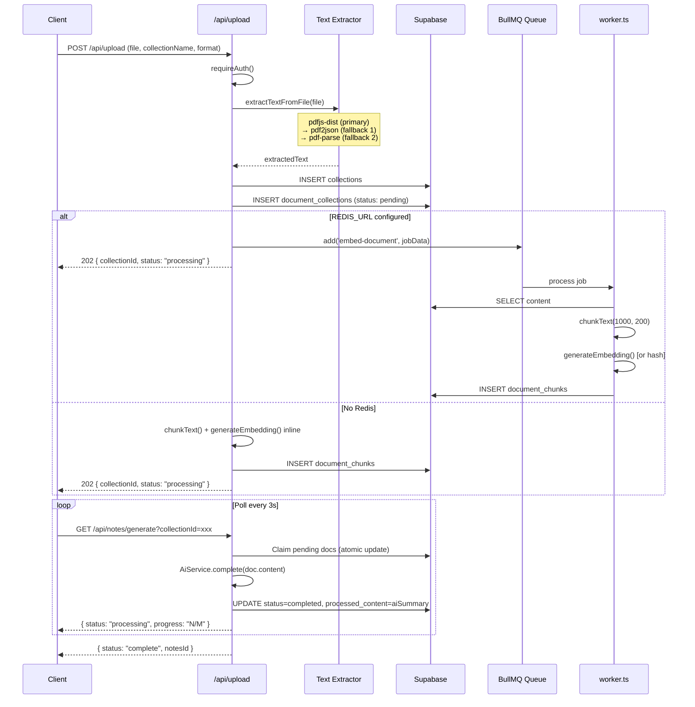
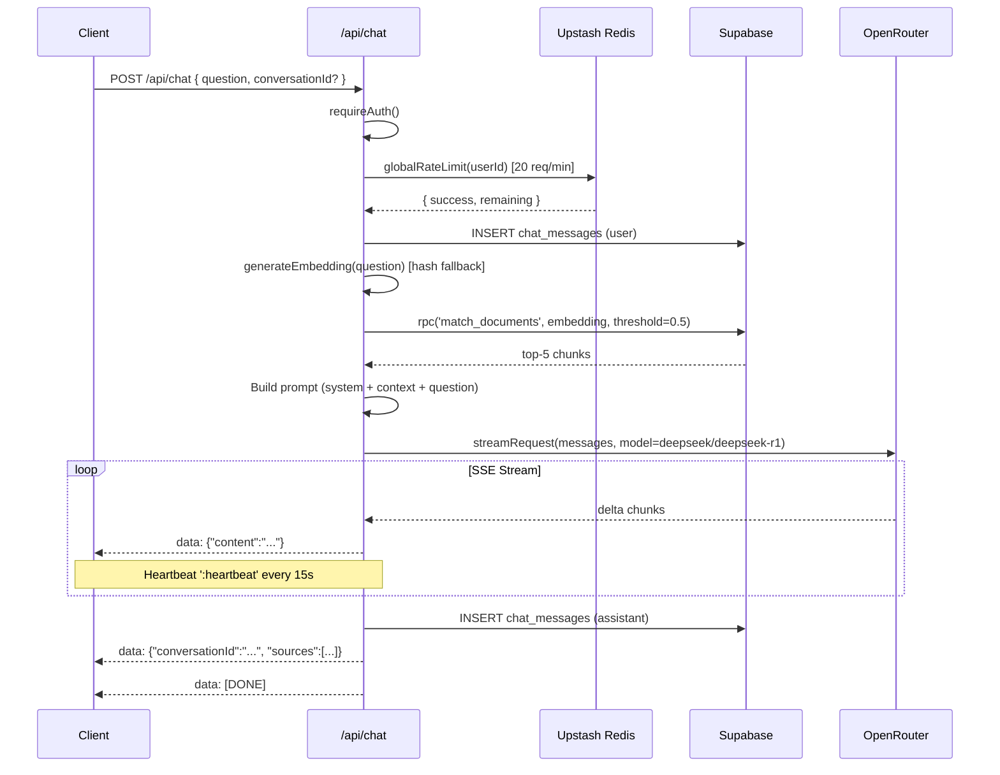
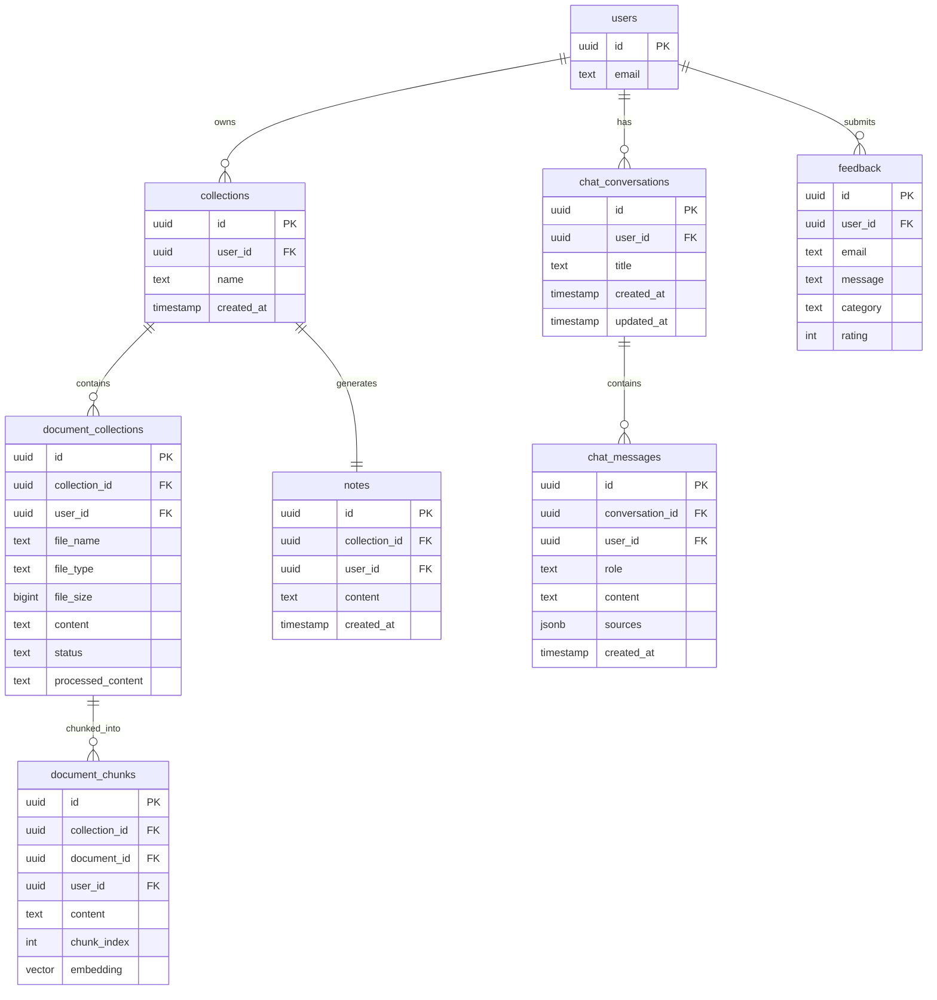

# CURRENT SYSTEM ARCHITECTURE
**QuickNotes — AI-Powered Study Assistant**
Generated: 2026-05-30 | Auditor: Claude Code (Principal Engineer Audit)

---

## 1. Executive Summary

**What the application does:**
QuickNotes is a SaaS platform that lets students and professionals upload study documents (PDF, DOCX, PPTX, TXT), automatically generate AI-powered study notes in multiple formats (key-points, MCQs, summaries, etc.), and chat with an AI assistant that has RAG-powered context from their uploaded documents.

**Target users:**
Students (university/college level), working professionals, and anyone who needs to quickly digest large amounts of study material.

**Core business value:**
- Eliminate manual note-taking by auto-generating structured study notes from raw documents
- Enable intelligent Q&A over personal document collections via RAG-powered chat
- Provide multiple export formats (PDF, copy to clipboard) for offline use

---

## 2. Technology Stack

| Layer | Technology | Version | Purpose |
|-------|-----------|---------|---------|
| **Frontend Framework** | Next.js | 16.1.1 | React framework with App Router (SSR/RSC) |
| **UI Library** | React | 19.2.3 | Component rendering with React Compiler |
| **Language** | TypeScript | 5.x | Type safety |
| **Styling** | Tailwind CSS | 4.2.1 | Utility-first CSS |
| **Icons** | Lucide React | 0.562.0 | SVG icon library |
| **Database** | Supabase (PostgreSQL) | 2.89.0 | Data persistence + pgvector embeddings |
| **Authentication** | Supabase Auth + Google OAuth | — | User management and session handling |
| **AI / LLM** | OpenRouter | — | LLM routing (DeepSeek R1 primary, Llama 3.3 70B fallback) |
| **Embeddings** | OpenAI text-embedding-3-small | — | Vector embeddings (with hash-based fallback) |
| **Rate Limiting** | Upstash Redis (HTTP REST) | 1.36.3 | Global distributed rate limiting + response caching |
| **Background Jobs** | BullMQ + IORedis | 5.76.10 / 5.10.1 | Async embedding generation worker |
| **PDF Parsing** | pdfjs-dist + pdf2json + pdf-parse | 5.4.530 / 4.0.0 / 2.4.5 | Multi-fallback PDF text extraction |
| **DOCX Parsing** | mammoth | 1.11.0 | Word document text extraction |
| **PDF Generation (client)** | jsPDF | 4.1.0 | Client-side PDF generation in browser |
| **PDF Generation (server)** | Custom HTML renderer | — | Server-rendered printable HTML (browser prints to PDF) |
| **Markdown Rendering** | react-markdown + remark-gfm + rehype-raw | 10.1.0 | Frontend markdown display |
| **Analytics** | Vercel Analytics + Speed Insights | 1.6.1 / 1.3.1 | Real-user monitoring and performance |
| **Deployment** | Vercel Serverless | — | Production hosting |

---

## 3. Folder Structure Analysis

```
f:\Backup\git-repos\quick\
├── app/                           # Next.js App Router (primary application code)
│   ├── api/                       # Server-side API routes
│   │   ├── upload/route.ts        # Document upload + text extraction + embedding queue
│   │   ├── chat/
│   │   │   ├── route.ts           # Main SSE streaming chat endpoint (RAG + LLM)
│   │   │   ├── save/route.ts      # Persist conversation to database
│   │   │   ├── history/route.ts   # List user conversations (Redis-cached)
│   │   │   ├── load/route.ts      # Load full conversation thread
│   │   │   ├── delete/route.ts    # Delete conversation + cache invalidation
│   │   │   ├── pdf/route.ts       # Generate printable HTML from markdown
│   │   │   └── export/route.ts    # Save chat export record to chat_exports table
│   │   ├── notes/
│   │   │   └── generate/route.ts  # Polling endpoint for note generation progress
│   │   └── feedback/route.ts      # User feedback submission + admin stats
│   ├── auth/
│   │   └── callback/route.ts      # Supabase OAuth code-exchange handler
│   ├── components/                # Reusable React components
│   │   ├── LandingPage.tsx        # Hero/marketing landing page
│   │   ├── Sidebar.tsx            # Navigation sidebar (chat history)
│   │   ├── FeedbackButton.tsx     # Floating feedback trigger button
│   │   ├── FeedbackForm.tsx       # Multi-step feedback collection form
│   │   ├── FeedbackAnalyticsDashboard.tsx  # Admin feedback analytics view
│   │   ├── StatusModal.tsx        # Toast-style status notification modal
│   │   ├── ConfirmationModal.tsx  # Generic confirmation dialog
│   │   └── *.test.tsx             # Component unit tests
│   ├── lib/                       # Shared utilities and service layers
│   │   ├── ai/
│   │   │   ├── aiService.ts       # Central AI service (streaming, completion, embedding)
│   │   │   └── openrouterGateway.ts  # OpenRouter HTTP gateway (circuit breaker, retry)
│   │   ├── auth/
│   │   │   └── requireAuth.ts     # Server-side auth middleware (Bearer + Cookie)
│   │   ├── errors/
│   │   │   └── errorHandler.ts    # Centralized error handling + user-friendly messages
│   │   ├── config.ts              # Application-wide configuration constants
│   │   ├── supabase.ts            # Singleton Supabase client for client components
│   │   ├── rateLimiter.redis.ts   # Redis-backed global rate limiter (ACTIVE)
│   │   ├── rateLimiter.ts         # In-memory rate limiter (UNUSED — replaced)
│   │   ├── clientPdfGenerator.ts  # jsPDF-based browser PDF generation
│   │   ├── professionalPdfGenerator.ts  # Custom HTML markdown renderer for server PDF
│   │   ├── pdfGenerator.ts        # HTML PDF generator using reportGenerator (UNUSED in prod)
│   │   ├── reportGenerator.ts     # Content cleaning/stripping utility (UNUSED in prod)
│   │   ├── markdown.tsx           # React Markdown component wrapper
│   │   ├── clipboard.ts           # Clipboard utilities
│   │   └── *.test.ts / *.test.tsx # Unit tests
│   ├── (pages)/
│   │   ├── page.tsx               # Root: renders LandingPage or redirects to /dashboard
│   │   ├── layout.tsx             # Root layout (Analytics, fonts, global styles)
│   │   ├── globals.css            # Global Tailwind directives
│   │   ├── upload/page.tsx        # Document upload interface
│   │   ├── chat/page.tsx          # Chat interface (RAG chat + note export)
│   │   ├── dashboard/page.tsx     # User dashboard (stats, folders, recent activity)
│   │   ├── notes/[id]/page.tsx    # Individual collection notes viewer
│   │   ├── saved/page.tsx         # Saved/bookmarked items
│   │   ├── exports/page.tsx       # Export history (PDF/DOC downloads)
│   │   ├── login/page.tsx         # Login page
│   │   ├── signup/page.tsx        # Signup page
│   │   ├── privacy/page.tsx       # Privacy policy
│   │   └── terms/page.tsx         # Terms of service
├── worker/                        # BullMQ background worker (runs OUTSIDE Vercel)
│   ├── queues.ts                  # Queue definition (upload-processing queue)
│   └── worker.ts                  # Job processor (generates document embeddings)
├── docs/
│   ├── ML-SYSTEM-DESIGN.md        # ML system design document
│   └── ml-systems-design.md       # DUPLICATE of ML-SYSTEM-DESIGN.md
├── middleware.ts                  # Next.js middleware (no-op pass-through — see §7)
├── next.config.ts                 # Next.js config (React Compiler enabled)
├── package.json                   # Dependencies and scripts
├── tsconfig.json                  # TypeScript configuration
├── .env.local                     # Local environment variables
├── convert-pdf.mjs                # Untracked utility script (purpose unclear)
├── convert-to-pdf.js              # Untracked utility script (purpose unclear)
└── [many .md documentation files] # See §11 Documentation Inventory
```

---

## 4. Feature Inventory

### 4.1 Document Upload & Text Extraction
- **User flow:** User navigates to `/upload`, selects files (PDF/DOCX/PPTX/TXT), names a collection, chooses output format and word count, clicks Upload.
- **Files used:** `app/upload/page.tsx`, `app/api/upload/route.ts`, `app/lib/ai/aiService.ts`
- **APIs used:** `POST /api/upload`
- **Database tables:** `collections`, `document_collections`, `document_chunks`
- **Status:** ✅ **Active**

### 4.2 AI Note Generation (Polling)
- **User flow:** After upload, client polls `GET /api/notes/generate?collectionId=xxx` every 3 seconds. Server atomically claims pending documents, generates AI summaries, marks them completed, returns progress. On completion, navigates to `/notes/[id]`.
- **Files used:** `app/api/notes/generate/route.ts`, `app/lib/ai/aiService.ts`, `app/components/StatusModal.tsx`
- **APIs used:** `GET /api/notes/generate`
- **Database tables:** `document_collections`, `notes`, `collections`
- **Status:** ✅ **Active**

### 4.3 Note Formats (9 types)
- **User flow:** User selects format during upload. Format determines the system prompt sent to the LLM.
- **Formats:** key-points, main-concepts, exam-points, short-notes, speech-notes, presentation-notes, summary, mcqs, quick-test
- **Files used:** `app/api/upload/route.ts` (`generateFormatPrompt()`)
- **Status:** ✅ **Active** (all 9 format prompts fully implemented)

### 4.4 RAG Chat
- **User flow:** User navigates to `/chat`, types a question. Server generates embedding, searches `document_chunks` via pgvector, injects relevant context into prompt, streams LLM response via SSE.
- **Files used:** `app/chat/page.tsx`, `app/api/chat/route.ts`, `app/lib/ai/aiService.ts`, `app/lib/ai/openrouterGateway.ts`
- **APIs used:** `POST /api/chat`, `POST /api/chat/save`, `GET /api/chat/history`, `GET /api/chat/load`, `DELETE /api/chat/delete`
- **Database tables:** `chat_conversations`, `chat_messages`, `document_chunks`
- **Status:** ✅ **Active**

### 4.5 Chat History & Management
- **User flow:** Sidebar shows recent conversations (fetched from `/api/chat/history`, Redis-cached). User can click to load a past conversation or delete it.
- **Files used:** `app/components/Sidebar.tsx`, `app/api/chat/history/route.ts`, `app/api/chat/load/route.ts`, `app/api/chat/delete/route.ts`
- **Status:** ✅ **Active**

### 4.6 PDF / HTML Export
- **User flow (server):** User clicks "Export PDF" in chat → `POST /api/chat/pdf` → server returns HTML → client opens in new window for browser printing.
- **User flow (client):** Direct jsPDF generation in exports page.
- **Files used:** `app/api/chat/pdf/route.ts`, `app/lib/professionalPdfGenerator.ts`, `app/lib/clientPdfGenerator.ts`, `app/exports/page.tsx`
- **APIs used:** `POST /api/chat/pdf`
- **Status:** ✅ **Active**

### 4.7 Chat Export Records
- **User flow:** After exporting chat, record is saved via `POST /api/chat/export`. Exports page lists all saved exports.
- **Files used:** `app/api/chat/export/route.ts`, `app/exports/page.tsx`
- **Database tables:** `chat_exports` (may not exist in all environments)
- **Status:** ⚠️ **Partially active** — `chat_exports` table may not be in the main schema; error handling exists for missing table.

### 4.8 User Dashboard
- **User flow:** `/dashboard` shows stats (total documents, topics generated, last session), folder list with document counts, recent activity feed.
- **Files used:** `app/dashboard/page.tsx`
- **Database tables:** `documents` (count only), `collections`, `document_collections`, `notes`
- **Status:** ✅ **Active** (queries `documents` table for count but actual upload stores to `document_collections`)

### 4.9 User Feedback
- **User flow:** Floating `FeedbackButton` → `FeedbackForm` multi-step form → `POST /api/feedback`.
- **Files used:** `app/components/FeedbackButton.tsx`, `app/components/FeedbackForm.tsx`, `app/api/feedback/route.ts`
- **APIs used:** `POST /api/feedback`, `GET /api/feedback` (admin)
- **Database tables:** `feedback`
- **Status:** ✅ **Active**

### 4.10 Background Embedding Worker
- **User flow:** When `REDIS_URL` is configured, upload route enqueues jobs to BullMQ. Separate Node.js process (`worker/worker.ts`) processes embedding jobs.
- **Files used:** `worker/queues.ts`, `worker/worker.ts`
- **Status:** ✅ **Active** (optional — falls back to inline sync if no Redis)

### 4.11 Saved Items
- **User flow:** `/saved` page — folder bookmarking uses localStorage in dashboard.
- **Files used:** `app/saved/page.tsx`
- **Status:** ⚠️ **Partially active** — bookmarks stored in localStorage; `/saved` page not yet wired up to display saved items from localStorage.

---

## 5. API Inventory

| Route | Method | Purpose | Used by Frontend | Used by Backend | Status |
|-------|--------|---------|-----------------|-----------------|--------|
| `/api/upload` | POST | Upload files, extract text, queue embeddings | Yes (upload page) | Worker | ✅ Active |
| `/api/notes/generate` | GET | Poll note generation progress | Yes (upload page) | — | ✅ Active |
| `/api/notes/generate` | POST | No-op (returns 200 hint) | No | No | ⚠️ Dead endpoint |
| `/api/chat` | POST | Stream chat response (SSE + RAG) | Yes (chat page) | — | ✅ Active |
| `/api/chat/save` | POST | Persist conversation + messages | Yes (chat page) | — | ✅ Active |
| `/api/chat/history` | GET | List conversations (Redis-cached) | Yes (sidebar) | — | ✅ Active |
| `/api/chat/load` | GET | Load full conversation thread | Yes (chat page) | — | ✅ Active |
| `/api/chat/delete` | DELETE | Delete conversation + invalidate cache | Yes (sidebar) | — | ✅ Active |
| `/api/chat/pdf` | POST | Generate printable HTML from markdown | Yes (chat page) | — | ✅ Active |
| `/api/chat/pdf` | OPTIONS | CORS preflight | Browser | — | ✅ Active |
| `/api/chat/export` | POST | Save export record to `chat_exports` | Yes (exports page) | — | ⚠️ Partial (table may not exist) |
| `/api/feedback` | POST | Submit user feedback | Yes (FeedbackForm) | — | ✅ Active |
| `/api/feedback` | GET | Admin feedback stats | No (admin only) | — | ✅ Active |
| `/api/auth/callback` | GET | OAuth code exchange (Google) | Supabase redirect | — | ✅ Active |

---

## 6. Database Inventory

### Tables (inferred from code queries)

| Table | Primary Key | Key Columns | Actively Used |
|-------|-------------|-------------|--------------|
| `collections` | `id` (UUID) | `user_id`, `name`, `created_at` | ✅ Yes |
| `document_collections` | `id` (UUID) | `collection_id`, `user_id`, `file_name`, `file_type`, `file_size`, `content`, `status`, `processed_content` | ✅ Yes |
| `document_chunks` | `id` (UUID) | `collection_id`, `document_id`, `user_id`, `content`, `chunk_index`, `embedding` (vector 384) | ✅ Yes |
| `notes` | `id` (UUID) | `collection_id`, `user_id`, `content`, `created_at` | ✅ Yes |
| `chat_conversations` | `id` (UUID) | `user_id`, `title`, `created_at`, `updated_at` | ✅ Yes |
| `chat_messages` | `id` (UUID) | `conversation_id`, `user_id`, `role`, `content`, `sources`, `created_at` | ✅ Yes |
| `feedback` | `id` (UUID) | `user_id`, `email`, `message`, `category`, `rating`, `title`, `features`, `improvements`, `would_recommend` | ✅ Yes |
| `documents` | `id` (UUID) | `user_id`, `created_at` | ⚠️ Counted in dashboard but not written to by upload route |
| `chat_exports` | `id` (UUID) | `user_id`, `conversation_id`, `title`, `content`, `type`, `created_at` | ⚠️ Partial (may not exist in all deployments) |

### Key Database Functions
- `match_documents(query_embedding, match_threshold, match_count, user_id)` — pgvector similarity search RPC

### Relationships
- `users` → `collections` (1:N)
- `collections` → `document_collections` (1:N)
- `collections` → `notes` (1:1, enforced by unique constraint on `collection_id`)
- `document_collections` → `document_chunks` (1:N)
- `users` → `chat_conversations` (1:N)
- `chat_conversations` → `chat_messages` (1:N)
- All tables have Row-Level Security (RLS) enabled

---

## 7. Authentication Flow

### Login Methods
1. **Google OAuth** — via Supabase Auth OAuth provider
2. **Email/Password** — standard Supabase Auth

### Session Handling
- Client-side: Singleton Supabase client (`app/lib/supabase.ts`) with `persistSession: true`, stored in `localStorage` under key `quicknotes-auth-token`
- Server-side: `@supabase/ssr` creates server client that reads cookies

### Auth Middleware (`app/lib/auth/requireAuth.ts`)
Two-strategy authentication for all protected API routes:

```
Strategy 1: Authorization: Bearer <JWT>
  → createClient with global Authorization header
  → supabase.auth.getUser()

Strategy 2: Cookies (fallback)
  → createServerClient with cookie store
  → supabase.auth.getUser()

On failure → AppError(401, 'UNAUTHORIZED')
```

### OAuth Callback (`app/auth/callback/route.ts`)
- Receives `?code=` from Supabase redirect
- Calls `supabase.auth.exchangeCodeForSession(code)`
- Redirects to origin (root)

### `middleware.ts` (Current State)
The file is registered for `/api/:path*` but is a **no-op pass-through**. Rate limiting was moved out of middleware into individual API routes. The file can be removed entirely.

---

## 8. AI Workflow

### 8.1 Upload Flow
```
POST /api/upload
  → requireAuth()
  → extractTextFromFile()
      Primary:   pdfjs-dist (getDocument + page.getTextContent)
      Fallback1: pdf2json (PDFParser)
      Fallback2: pdf-parse (default export)
      DOCX:      mammoth.extractRawText()
      PPTX:      placeholder text (not fully extracted)
      TXT:       TextDecoder
  → INSERT collections
  → INSERT document_collections (status: 'pending')
  → IF REDIS_URL configured:
      BullMQ.add('embed-document', jobData)   ← async
    ELSE:
      chunkText(1000 chars, 200 overlap)
      AiService.generateEmbedding() × batch   ← sync
      INSERT document_chunks
  → 202 response { collectionId, status: "processing" }
```

### 8.2 Note Generation Flow
```
GET /api/notes/generate?collectionId=xxx  (polled every 3s)
  → requireAuth()
  → SELECT document_collections WHERE status='pending' LIMIT 3
  → IF none pending AND none processing:
      SELECT content FROM document_collections WHERE status='completed'
      AiService.complete([systemPrompt, combinedText])
      UPSERT notes ON CONFLICT(collection_id)
      → { status: "complete", notesId }
  → ELSE:
      UPDATE document_collections SET status='processing' WHERE id IN (pendingIds)
      FOR EACH claimed doc (parallel):
        AiService.complete([system, doc.content.slice(0,15000)])
        UPDATE document_collections SET status='completed', processed_content=aiSummary
      → { status: "processing", progress: "N/M", currentFile }
```

### 8.3 Chat Flow
```
POST /api/chat { question, conversationId?, title? }
  → requireAuth()
  → globalRateLimit(userId)   ← Upstash Redis sliding window 20/min
  → INSERT chat_messages (user) if not duplicate
  → AiService.generateEmbedding(question) → embedding[]
  → supabase.rpc('match_documents', { embedding, threshold: 0.5, count: 5 })
  → Build prompt with context chunks
  → AiService.streamChat() → ReadableStream
  → TransformStream:
      - Heartbeat every 15s (': heartbeat\n\n') ← prevents proxy timeout
      - Spy on content → accumulate assistantContent
      - On flush: INSERT chat_messages (assistant) + send { conversationId, sources }
  → Response: text/event-stream SSE
```

### 8.4 AI Gateway (OpenRouter)
```
OpenRouterGateway.request(payload)
  → isCircuitOpen()?  ← opens after 5 consecutive failures, resets after 30s
      YES → throw Error
  → fetchWithRetry(payload, CONFIG.AI.DEFAULT_MODEL, attempt=0)
      timeout: 90s (streaming) / 35s (completion)
      on 429/5xx with attempts remaining → exponential backoff (2^attempt × 1000ms)
      on final fail → try FALLBACK_MODEL
      on fallback fail → recordFailure()
  → recordSuccess()
```

### 8.5 Embedding Generation
```
AiService.generateEmbedding(text)
  → IF OPENAI_API_KEY not set (currently disabled in .env):
      hashEmbedding(text) → deterministic 384-dim float array
  → ELSE:
      POST https://api.openai.com/v1/embeddings (text-embedding-3-small)
      on failure → hashEmbedding(text)
```

**Note:** `OPENAI_API_KEY` is currently commented out in `.env.local`. All embeddings are hash-based in the current deployment. This significantly degrades RAG search quality.

### 8.6 Export Flow
```
POST /api/chat/pdf { markdown, title }
  → requireAuth()
  → generatePrintableHTML(markdown, title)   ← professionalPdfGenerator.ts
  → Response: text/html (browser opens in new window, user prints to PDF)
```

---

## 9. External Dependencies

### Production Dependencies

| Package | Purpose | Import Count | Status |
|---------|---------|-------------|--------|
| `next@16.1.1` | React framework | Framework | ✅ Core |
| `react@19.2.3` | UI rendering | Framework | ✅ Core |
| `react-dom@19.2.3` | DOM rendering | Framework | ✅ Core |
| `@supabase/supabase-js@2.89.0` | Database client | 4 files | ✅ Used |
| `@supabase/ssr@0.5.2` | SSR auth helpers | 4 files | ✅ Used |
| `@supabase/auth-helpers-nextjs@0.15.0` | Auth integration | 0 files | ⚠️ Possibly unused (superseded by @supabase/ssr) |
| `@upstash/ratelimit@2.0.8` | Redis rate limiting | 2 files | ✅ Used |
| `@upstash/redis@1.36.3` | Upstash Redis client | 1 file | ✅ Used |
| `@vercel/analytics@1.6.1` | Page analytics | layout.tsx | ✅ Used |
| `@vercel/speed-insights@1.3.1` | Performance RUM | layout.tsx | ✅ Used |
| `bullmq@5.76.10` | Job queue | worker/ | ✅ Used |
| `ioredis@5.10.1` | Redis TCP client | worker/queues.ts | ✅ Used |
| `jspdf@4.1.0` | PDF generation (browser) | exports/page.tsx, clientPdfGenerator.ts | ✅ Used |
| `mammoth@1.11.0` | DOCX extraction | upload/route.ts | ✅ Used |
| `pdf-parse@2.4.5` | PDF parsing (fallback 3) | upload/route.ts | ✅ Used |
| `pdf2json@4.0.0` | PDF parsing (fallback 2) | upload/route.ts | ✅ Used |
| `pdfjs-dist@5.4.530` | PDF parsing (primary) | upload/route.ts | ✅ Used |
| `react-markdown@10.1.0` | Markdown rendering | markdown.tsx | ✅ Used |
| `rehype-raw@7.0.0` | HTML in markdown | markdown.tsx | ✅ Used |
| `remark-gfm@4.0.1` | GFM markdown | markdown.tsx | ✅ Used |
| `lucide-react@0.562.0` | Icons | Multiple pages/components | ✅ Used |
| `tailwind-merge@3.4.0` | Tailwind class merge | — | ⚠️ No imports found |
| `@radix-ui/react-dialog@1.1.15` | Dialog primitive | — | ⚠️ No imports found |
| `@radix-ui/react-icons@1.3.2` | Radix icons | — | ⚠️ No imports found |
| `@radix-ui/react-slot@1.2.4` | Slot primitive | — | ⚠️ No imports found |
| `class-variance-authority@0.7.1` | Component variants | — | ⚠️ No imports found |
| `clsx@2.1.1` | Class names | — | ⚠️ No imports found |

### Dev Dependencies

| Package | Purpose | Status |
|---------|---------|--------|
| `@playwright/test@1.58.2` | E2E testing | ✅ Used |
| `@tailwindcss/postcss@4` | PostCSS plugin | ✅ Used |
| `@testing-library/react@16.3.2` | React component tests | ✅ Used |
| `@testing-library/jest-dom@6.9.1` | Jest DOM matchers | ✅ Used |
| `@testing-library/user-event@14.6.1` | User event simulation | ✅ Used |
| `@types/dotenv@6.1.1` | TypeScript types | ⚠️ dotenv is a devDep too |
| `@types/jest@30.0.0` | Jest types | ✅ Used |
| `@types/node@20` | Node types | ✅ Used |
| `@types/react@19` | React types | ✅ Used |
| `@types/react-dom@19` | React DOM types | ✅ Used |
| `autoprefixer@10.4.27` | CSS autoprefixing | ✅ Used |
| `babel-plugin-react-compiler@1.0.0` | React Compiler Babel | ✅ Used |
| `cross-env@10.1.0` | Cross-platform env | ✅ Used |
| `dotenv@17.3.1` | .env loading | ✅ Used (tests) |
| `eslint@9` | Linting | ✅ Used |
| `eslint-config-next@16.1.1` | Next.js ESLint rules | ✅ Used |
| `jest@30.2.0` | Unit test runner | ✅ Used |
| `jest-environment-jsdom@30.2.0` | JSDOM for tests | ✅ Used |
| `postcss@8.5.6` | CSS processing | ✅ Used |
| `tailwindcss@4.2.1` | CSS framework | ✅ Used |
| `ts-jest@29.4.6` | TypeScript Jest transformer | ✅ Used |
| `ts-node@10.9.2` | TS execution (scripts) | ✅ Used |
| `tsx@4.21.0` | Modern TS execution | ✅ Used (worker) |
| `typescript@5` | Compiler | ✅ Used |

---

## 10. Environment Variables

| Variable | Where Used | Required/Optional | Status |
|----------|-----------|-------------------|--------|
| `NEXT_PUBLIC_SUPABASE_URL` | `supabase.ts`, `requireAuth.ts`, all API routes | Required | ✅ Active |
| `NEXT_PUBLIC_SUPABASE_ANON_KEY` | `supabase.ts`, `requireAuth.ts`, all API routes | Required | ✅ Active |
| `SUPABASE_SERVICE_ROLE_KEY` | `notes/generate/route.ts`, `chat/save/route.ts`, `chat/export/route.ts` | Required | ✅ Active |
| `NEXT_PUBLIC_SITE_URL` | `openrouterGateway.ts` (HTTP-Referer header), `chat/pdf/route.ts` (CORS) | Optional | ✅ Active |
| `OPENROUTER_API_KEY` | `openrouterGateway.ts` | Required for AI | ✅ Active |
| `UPSTASH_REDIS_REST_URL` | `rateLimiter.redis.ts` | Optional (disables Redis if absent) | ✅ Active |
| `UPSTASH_REDIS_REST_TOKEN` | `rateLimiter.redis.ts` | Optional | ✅ Active |
| `AI_MODEL` | `config.ts` → `CONFIG.AI.DEFAULT_MODEL` | Optional (default: `deepseek/deepseek-r1`) | ⚠️ Set to `gemini-2.0-flash-001` — mismatched with OpenRouter |
| `MAX_TOKENS` | `config.ts` → `CONFIG.AI.MAX_TOKENS` | Optional (default: 4096) | ✅ Active |
| `AI_CONCURRENCY` | `config.ts` → `CONFIG.AI.CONCURRENCY_LIMIT` | Optional (default: 8) | ✅ Active |
| `RATE_LIMIT` | `config.ts` → `CONFIG.RATE_LIMIT.MAX_REQUESTS_PER_MINUTE` | Optional (default: 15) | ✅ Active |
| `FALLBACK_MODEL` | `config.ts` → `CONFIG.AI.FALLBACK_MODEL` | Optional | ✅ Active |
| `DEBUG_MODE` | `config.ts` → `CONFIG.DEBUG_MODE` | Optional | ✅ Active |
| `AI_TEMPERATURE` | `config.ts` | Optional (default: 0.7) | ✅ Active |
| `AI_TIMEOUT` | `config.ts` | Optional (default: 25000ms) | ✅ Active |
| `REDIS_URL` | `worker/queues.ts`, `upload/route.ts` (lazy import) | Optional (enables async worker) | Active for worker only |
| `OPENAI_API_KEY` | `aiService.ts`, `worker/worker.ts` | Optional (uses hash embedding if absent) | ⚠️ Commented out in .env.local |
| `PORTKEY_API_KEY` | Not used in any source file | — | ❌ Unused |
| `PORTKEY_GATEWAY_URL` | Not used in any source file | — | ❌ Unused |
| `PORTKEY_CHAT_CONFIG_ID` | Not used in any source file | — | ❌ Unused |
| `PORTKEY_NOTES_CONFIG_ID` | Not used in any source file | — | ❌ Unused |
| `CLOUDFLARE_GATEWAY_URL` | Not used in any source file | — | ❌ Unused |
| `CLOUDFLARE_API_KEY` | Not used in any source file | — | ❌ Unused |
| `CF_ACCOUNT_ID` | Not used in any source file | — | ❌ Unused |
| `GOOGLE_GENERATIVE_AI_API_KEY` | Not used in any source file | — | ❌ Unused |

---

## 11. Architecture Diagrams

### 11.1 System Architecture



### 11.2 Upload & Processing Flow



### 11.3 Chat (RAG) Flow



### 11.4 Database Entity Relationships



---

## 12. Known Issues & Technical Debt

| Issue | Severity | Notes |
|-------|----------|-------|
| `OPENAI_API_KEY` commented out → hash embeddings active | High | RAG search quality is significantly degraded; cosine similarity on hash vectors is essentially random |
| `AI_MODEL=gemini-2.0-flash-001` but OpenRouter route used | Medium | Config mismatch; `gemini-2.0-flash-001` is not a valid OpenRouter model identifier |
| `documents` table queried in dashboard but never written to | Medium | Upload route writes to `document_collections` not `documents`; dashboard stats may be wrong |
| `middleware.ts` is a registered no-op | Low | Adds cold-start overhead without any functionality |
| `chat_exports` table may not exist in all environments | Medium | Graceful error handling exists but exports history is broken if table absent |
| 3 PDF parsing libraries loaded (pdfjs-dist + pdf2json + pdf-parse) | Medium | All three bundled for fallback chain; large bundle size on serverless functions |
| Portkey/Cloudflare/Google env vars present but unused | Low | Config bloat and potential confusion about which AI gateway is active |
| `app/saved/page.tsx` not wired to localStorage bookmarks | Low | `/saved` route exists but shows nothing useful |
